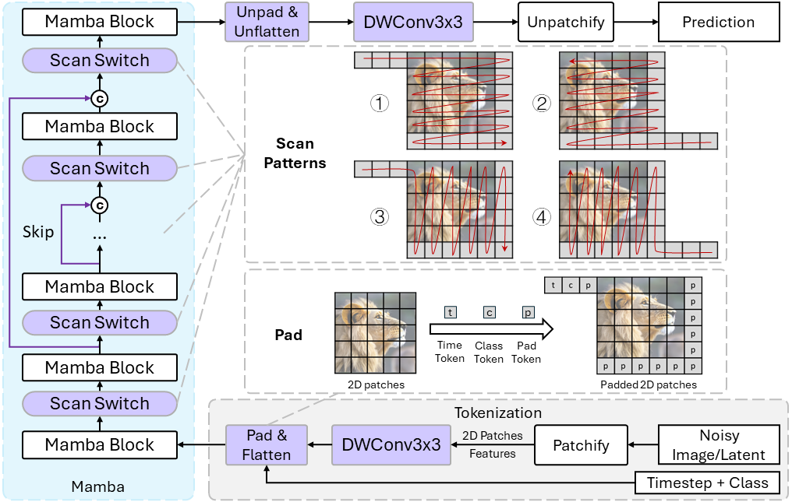

# DiM: Diffusion Mamba for Efficient High-Resolution Image Synthesis

The official implementation of our paper [DiM: Diffusion Mamba for Efficient High-Resolution Image Synthesis](https://arxiv.org/abs/2405.14224).


## Method Overview



## Acknowledge

This code is mainly built on [U-ViT](https://github.com/baofff/U-ViT) and [Mamba](https://github.com/state-spaces/mamba).

Installing Mamba may cost a lot of effort. If you encounter problems, this [issues in Mamba](https://github.com/state-spaces/mamba/issues) may be very helpful.

## Installation

```bash
# create env:
conda env create -f environment.yaml

# if you want to update the env `mamba` with the contents in `~/mamba_attn/environment.yaml`:
conda env update --name mamba --file ~/mamba_attn/environment.yaml --prune

# Compiling Mamba. You need to successfully install causal-conv1d first.
CAUSAL_CONV1D_FORCE_BUILD=TRUE pip install --user -e .
# If failing to compile, copy the files in ./build/ on another server which has compiled successfully; Maybe --user is necessary.
```

## Preparation Before Training and Evaluation

Please follow [U-ViT](https://github.com/baofff/U-ViT), the same subtitle.

## Checkpoints

|                            Model                             | FID  | training iterations | batch size |
| :----------------------------------------------------------: | :--: | :-----------------: | :--------: |
| [ImageNet 256x256 (Huge/2)](https://drive.google.com/drive/folders/1TTEXKKhnJcEV9jeZbZYlXjiPyV87ZhE0?usp=sharing) | 2.40 |        425K         |    768     |
| [ImageNet 512x512 (fine-tuned Huge/2)](https://drive.google.com/drive/folders/1lupf4_dj4tWCpycnraGrgqh4P-6yK5Xe?usp=sharing) | 3.94 |      Fine-tune      |    240     |

**Note:**

**We use `nnet_ema.pth` for evaluation instead of `nnet.pth`.**

**`nnet.pth` is the trained model, while `nnet_ema.pth` is the EMA of model weights.**

## Evaluation

**Use `eval_ldm_discrete.py` for evaluation and generating images with CFG**

```sh
# ImageNet 256x256 
accelerate launch --multi_gpu --gpu_ids 0,1,2,3,4,5,6,7 --main_process_port 20039 --num_processes 8 --mixed_precision bf16 ./eval_ldm_discrete.py --config=configs/imagenet256_H_DiM.py --nnet_path='workdir/imagenet256_H_DiM/default/ckpts/425000.ckpt/nnet_ema.pth'

# ImageNet 512x512 
accelerate launch --multi_gpu --gpu_ids 0,1,2,3,4,5,6,7 --main_process_port 20039 --num_processes 8 --mixed_precision bf16 ./eval_ldm_discrete.py --config=configs/imagenet512_H_DiM_ft.py --nnet_path='workdir/imagenet512_H_DiM_ft/default/ckpts/64000.ckpt/nnet_ema.pth'

# ImageNet 512x512 upsample 2x, the generated images are in `workdir/imagenet512_H_DiM_ft/test_tmp` which is set in config.
accelerate launch --multi_gpu --gpu_ids 0,1,2,3,4,5,6,7 --main_process_port 20039 --num_processes 8 --mixed_precision bf16 ./eval_ldm_discrete.py --config=configs/imagenet512_H_DiM_upsample_test.py --nnet_path='workdir/imagenet512_H_DiM_ft/default/ckpts/64000.ckpt/nnet_ema.pth'

# ImageNet 512x512 upsample 3x, the generated images are in `workdir/imagenet512_H_DiM_ft/test_tmp` which is set in config.
accelerate launch --multi_gpu --gpu_ids 0,1,2,3,4,5,6,7 --main_process_port 20039 --num_processes 8 --mixed_precision bf16 ./eval_ldm_discrete.py --config=configs/imagenet512_H_DiM_upsample_3x_test.py --nnet_path='workdir/imagenet512_H_DiM_ft/default/ckpts/64000.ckpt/nnet_ema.pth'
```

## Training

```sh
# Cifar 32x32
accelerate launch --multi_gpu --num_processes 8 --mixed_precision fp16 ./train_ldm_discrete.py --config=configs/imagenet256_H_DiM.py

# ImageNet 256x256 
accelerate launch --multi_gpu --num_processes 8 --mixed_precision bf16 ./train_ldm_discrete.py --config=configs/imagenet256_H_DiM.py

# ImageNet 512x512 
accelerate launch --multi_gpu --num_processes 8 --mixed_precision bf16 ./train_ldm_discrete.py --config=configs/imagenet512_H_DiM_ft.py
```

# Citation

```
@misc{teng2024dim,
      title={DiM: Diffusion Mamba for Efficient High-Resolution Image Synthesis}, 
      author={Yao Teng and Yue Wu and Han Shi and Xuefei Ning and Guohao Dai and Yu Wang and Zhenguo Li and Xihui Liu},
      year={2024},
      eprint={2405.14224},
      archivePrefix={arXiv},
      primaryClass={cs.CV}
}
```

